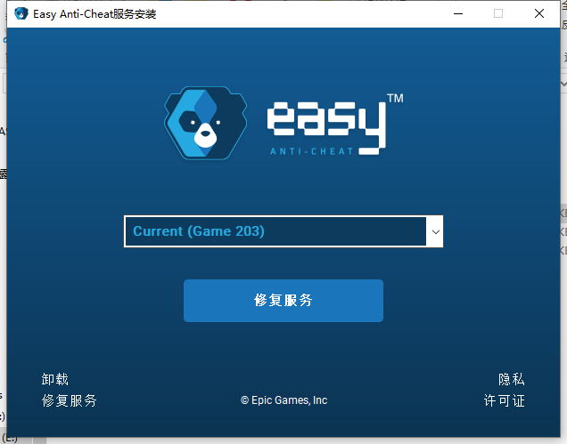
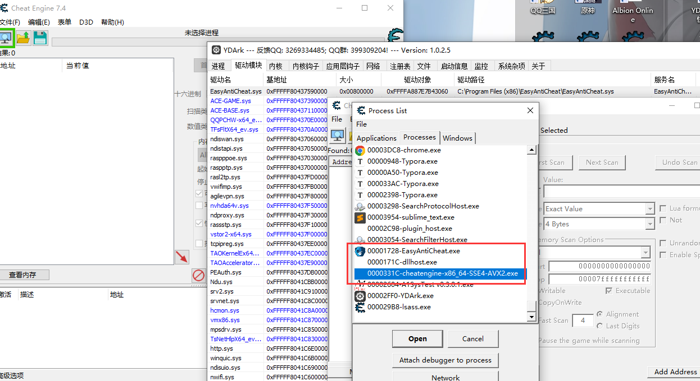
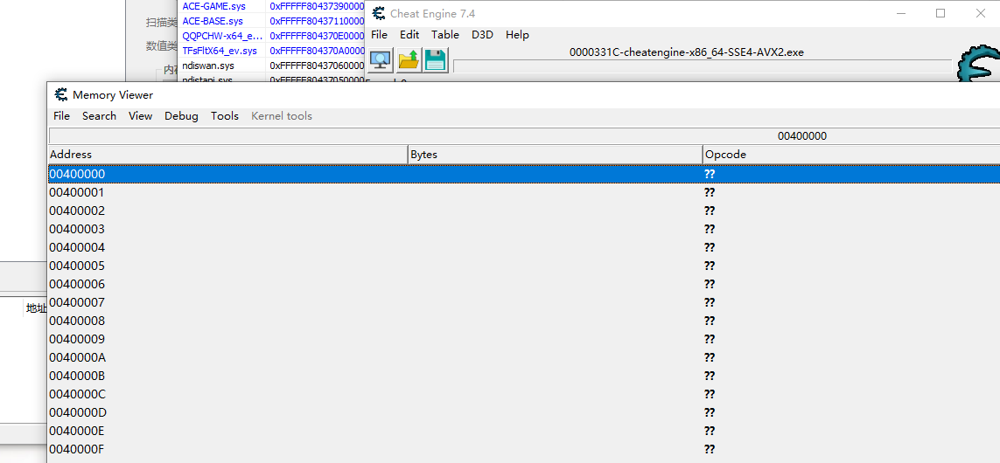

# EAC-Protect-Process
一次偶然的研究中发现可以利用EasyAntiCheat.sys驱动来保护我们指定的进程

1.简述：
一次偶然的研究中发现可以利用EasyAntiCheat.sys驱动来保护我们指定的进程

2.历程：
Albion Online这个游戏使用EAC保护，在一次研究EAC的过程中，无意间发现可以利用Albion Online登陆器来启动EAC来保护我们指定的进程。

3.具体操作步骤:
(1).如果你是第一次使用EAC，那么你需要安装EAC，于项目**EAC-Protect-Process\EacProtectCE\EasyAntiCheat\EasyAntiCheat_Setup.exe**。

(2).编辑脚本指定启动保护的进程，于项目**EAC-Protect-Process\EacProtectCE\EasyAntiCheat\Launcher\Settings.json**。

(3).管理员权限启动**RunCheatEngine.exe**，即可保护。

4.注意:

因为EAC只能保护一个进程，所以使用EAC来保护我们进程的时候无法玩EAC保护的游戏。

如果你喜欢这个，可以给我star我(●'◡'●)

